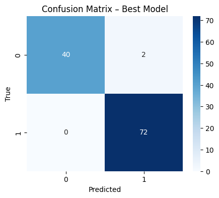

Markdown

# Machine Learning project focused on classifying breast tumors as malignant or benign using Python and scikit-learn.

The objective was to build and evaluate classification models while minimizing False Negatives, the most critical error in medical diagnostics.
---

## My Contribution
✔ Exploratory Data Analysis (EDA)

✔ Data preprocessing

✔ Feature scaling (StandardScaler)

✔ Model training

✔ Hyperparameter tuning

✔ Cross-validation

✔ Model evaluation

✔ Results interpretation

---

## Tech Stack
Python

Pandas

NumPy

Matplotlib

Scikit-learn

## Model	Cross Validation Accuracy
Logistic Regression (L1, C=1)	96.0%
Logistic Regression (L1, C=0.5)	96.0%
Random Forest (200 trees)	95.6%
Random Forest (100 trees)	95.6%
Logistic Regression (C=0.01)	93.0%
Decision Tree	92.9%

### 3. Final Production Model Evaluation & Confusion Matrix
Accuracy

98.2%

False Negatives

0

False Positives

2

## Key Insights
• Logistic Regression achieved the best overall performance.

• Cross-validation reduced the risk of overfitting.

• The final model successfully classified all malignant tumors without any False Negatives.

---

